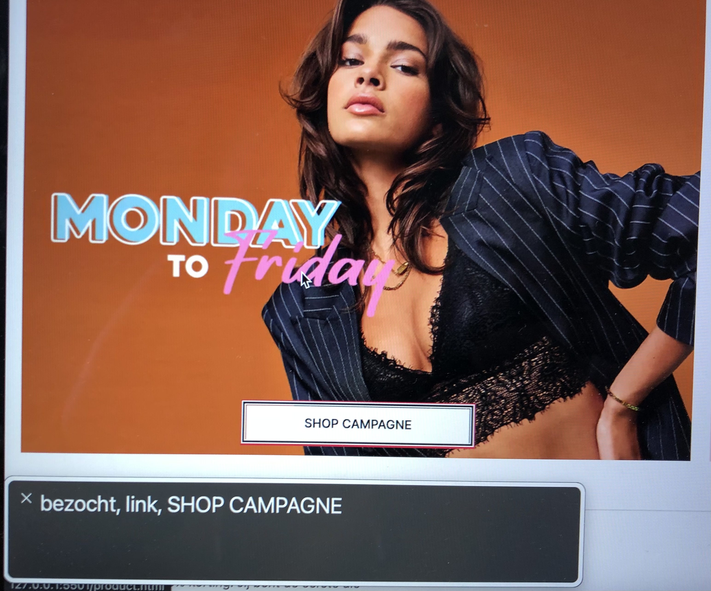

# Procesverslag
Hier kun je mijn procesverslag lezen. In mijn proces verslag heb ik het over wat ik lastig vond om te doen en wat goed ging. Ook heb ik erin staan waar ik graag nog aan wil werken na de voortgangsgesprekken. Als laatste heb ik ook een verslag geschreven over waar ik tegen aanliep met de toegankelijkstest en hoe ik deze problemen eventueel zou kunnen oplossen.

## Jij

Uitwerken voor kick-off werkgroep

### Auteur:
Ine van den Hoven

#### Je startniveau:
Rood

#### Je focus:
Ik ga mij focussen op responsive, maar wil ook een beetje aan de surface plane werken. 
 

## Je website

Uitwerken voor kick-off werkgroep

### Je opdracht:
Ik ga twee pagina's van de website https://www.loavies.com/nl uitwerken.

#### Screenshot(s) van de eerste pagina (small screen): 
Homepage 

#### Screenshot(s) van de tweede pagina (small screen):
Product pagina 

 

## Breakdownschets (week 1)

Uitwerken na afloop 2e werkgroep

### De hele homepagina: 

### De hele productpagina: 

### Dynamisch deel (bijv menu): 

## Voortgang 1 (week 2)

Uitwerken voor 1e voortgang

### Stand van zaken
hier dit ging goed & dit was lastig (neem ook screenshots op van delen van je website en code)

Tot nu toe gaat de opdracht redelijk goed. Het schrijven van de CSS vind ik tot nu toe erg goed gaan. Ik heb de twee pagina's nu bijna hellemaal staan. Wat ik wel lastig vind is het goed semantisch schrijven van de HTML. Ik twijfel regelmatig over of het wel semantisch correct is. 

 
Is deze HTML wel goed semantisch?

Daarnaast kreeg ik bij het stylen van de tweede pagina wat problemen, omdat de HTML dan delen van de CSS pakt van de andere pagina. Dit komt doordat de elementen hetzelfde heten. Dit heb ik opgelost door op de body van de tweede pagina (de productpage) een id op de body te zetten. Hierdoor kan ik deze pagina stylen zonder dat deze CSS pakt van de homepage elementen.

 
Hier zie je de CSS die is toegevoegd voor de product pagina, maar ook aan de homepage word toegevoegd.

 
De uitkomst van de CSS hierboven.

 
Het element gaat fout doordat er nieuwe CSS is toegevoegd aan de product pagina.

 
Door deze code staan twee elementen niet meer goed, op de homepage.

### Agenda voor meeting
samen met je groepje opstellen

| Ik             | Sterre             | Mathijs             | Arsenio          |
| ---            | ---                | ---                 | ---              |
| html semantisch| html semantisch    | Of div en classes   | HTML bekijken    |
| id gebruiken   | CSS                | goed zijn.          | CSS bekijken     |

### Verslag van meeting
hier na afloop snel de uitkomsten van de meeting vastleggen

- Button inplaats van span gebruiken voor menu.
- Banners uit de header halen en in de main zetten.
- Headings platsen in articles en deze niet zichtbaar maken.
- H1 om SVG zetten, omdat dit het belangrijkste is en dan title op svg met wat het is.
- CSS selectors korter maken.
- Meer verschillende CSS selectors gebruiken, zoals + en >.

## Voortgang 2 (week 3)

uitwerken voor 2e voortgang

### Stand van zaken
Deze week ben ik begonnen met het responsive maken van de twee pagina's dit vind ik van mobiel naar desktop toch wel een beetje lastig. Ik ben namelijk gewend om van desktop naar mobiel te werken. Tot nu toe heb ik een aantal onderdelen van de website resposive gemaakt, waaronder het menu, de categorieën en de slider op de homepage. 
 

 
Hier zie je hoe ik het menu voor mobiel heb gemaakt. Dit heb ik met grid naast elkaar gezet. Voor de desktop versie heb ik ervoor gezorgd dat het alle linkjes die voor mobiel in het hamburgermenu zitten nu in de onder de menubalk vallen.
 

 
Voor de categorieën heb ik ervoor gezorgd dat wanneer het scherm groter is dan het element deze in het midden word uitgelijnd. Op mobiel kun je namelijk opzij scrollen doormiddel van overflow-x scroll. Met Flexbox heb ik ervoor gezorgd dat dit element op desktop in het midden uitlijnd.
 

 
Bij de looks heb ik ervoor gekozen om dit op alle schermen te kunnen laten scrollen alleen wanneer het scherm groter word kommen er steeds meer looks in beeld. Op mobiel zie je er eerst alleen de eerste voledig wanneer je het scherm groter maakt komen er steeds meer in beeld.

### Agenda voor meeting
samen met je groepje opstellen

| Ik             | Sterre             | Mathijs      | Arsenio          |
| ---            | ---                | ---          | ---              |
| Responsive     | Het menu           | Divjes en    | Vragen over het  |
| Grid           | Formulier blok     | classes      | menu             |
| Afbeeldingen   | anders plaatsen    | veranderen   |                  |

### Verslag van meeting
hier na afloop snel de uitkomsten van de meeting vastleggen

- Picture en source gebruiken voor andere afbeelding op desktop.
- Object-fit gebruiken 
- Position veranderen van de object-fit

## Toegankelijkheidstest (week 4)

Uitwerken na test in 8e voortgang

### Bevindingen
Lijst met mijn bevindingen die in de test naar voren kwamen:
1. Focus gaat niet helemaal goed.
2. Buttons en linkjes waren soms te klein om op te kunnen klikken.
3. De tekst is niet voor alle beperkingen goed te lezen.
4. Voor sommige beperkingen heeft de website te veel informatie op het scherm.

#### Focus voor screenreaders
Het gebruiken van de VoiceOver op mac ging redelijk goed. Via de VO toets bij mij de Caps Lock toets kun je makkelijk door de elementen met focos heen gaan. Daarnaast kan je ook door de linkjes gaan via de VO toets (Caps Lock) + Command + L. Ook heb ik uitgezocht hoe je alleen de headings kan laten oplezen. Doe doe je met de VO + Command + H toetsen. Ik kwam wel tegen een aantal problemen aan. Zo leest de VoiceOver eerst het onderste deel van het menu voor en daarna pas het bovenste deel met de h1. De VoiceOver van mac plaatst gelukkig zelf ook een focus om de plek waar je op het moment bent. Maar wanneer dat niet het geval zou zijn en er word tekst voorgelezen uit een heading of paragraaf dan zou de gebruiker niet meer weten waar hij/zij zich bevind. Ook staan er teksten op de website die voor mensen zonder beperking duidelijk zijn, maar voor iemand die een screen reader gebruikt niet. 

Om deze problemen op te lossen zou ik de belangrijkheid bij de navigatie moeten aanpassen. Zo zou het logo de h1 als eerste opgelezen moeten worden zodat de gebruiker meteen weet op welke website hij/zij is. Er voor zorgen dat wanneer de screenreader op tekst is gefocust daar ook een focus omheen komt. Als laatste zou ik screen reader only tekst kunnen plaatsen die alleen worden gezien door de screenreaders, zodat zij begrijpen waar het over gaat.

#### Buttons en linkjes te klein
Voor veel verschillende beperkingen, zoals erg wazig zien, spasme of parkinson is het moeilijk om op de buttons en linkjes te klikken. Deze zijn redelijk klein op de website waardoor je er al snel naast klikt.

Dit probleem is op te lossen door grotere vlakken te maken waar de gebruiker op kan klikken, zoals door een banner/afbeelding geheel klikbaar te maken. 

#### Tekst niet goed te lezen 
Voor verschillende beperkingen, zoals iemand die wazig ziet of een vlek in zijn/haar beeld ziet is de tekst op verschillende plekken moeilijk te lezen. Dit komt doordat de tekst op verschillende plekken te klein is.

Dit is op te lossen door de website in te zoomen, hierdoor wordt de tekst grooter en beter leesbaar. Een andere oplossing is door een button toe te voegen waarmee de gebruiker de tekst groter kan maken.

#### Te veel informatie op het scherm 
Voor mensen die snel afgeleid zijn is het erg moeilijk om een website te gebruiken. De website die ik heb nagemaakt is voor dit soort gebruikers ook erg moeilijk te gebruiken. Dit komt doordat er veel verschillende elementen op staan. 

De oplossing hiervoor is om minder elementen op de pagina te plaatsen, hierdoor is het voor deze gebruikers makkelijker om de pagina te bekijken. Daarnaast is het slim om meer witruimte tussen elementen te zetten. 

## Voortgang 3 (week 4)

Uitwerken voor 3e voortgang

### Stand van zaken
Deze week heb ik het responsive maken van de website zo goed als afgemaakt. De website is nu responsive. Het zorgen dat de afbeeldingen naast elkaar gaan staan in een grid en dan de tekst ernaast zetten vond ik wat lastig, maar na verschillende dingen uitgeprobeerd te hebben is het toch gelukt. 

Daarnaast vond ik het moeilijk om ervoor te zorgen dat het kiezen van een taal op desktop in de footer onder de social media te krijgen. Dit heb ik uiteindelijk met grid en margin voor elkaar gekregen.  

Wat goed ging deze week was de tip die ik van de student assistenten heb gekregen bij het voortgangsgesprek. Ik heb de rechtopstaande afbeeldingen voor mobiel vanaf tablet vervangen door liggende afbeeldingen, zodat de afbeeldingen niet mega groot worden. Dit heb ik gedaan door om de afbeelding een picture te zetten en daarin een source te plaatsen met wanneer de afbeelding moet veranderen en welke afbeelding daarvoor in de plaats moet komen. 

Wat ik aankomende week wil gaan doen is:
1. Checken of de website nog punten van verbetering heeft op het gebied van responsive.
2. De website door een validator halen.
3. Kijken of ik leuke animations en transitions kan toevoegen.
4. De focus op verschillende plekken verbeteren.

### Agenda voor meeting
samen met je groepje opstellen

| Ik             | Sterre          | Mathijs        | Arsenio            |
| ---            | ---             | ---            | ---                |
| Overal even    | HTML bekijken   | Algemeen       | Tab focus states   |
| doorheen lopen | Overal doorheen | doorheen lopen.| bekijken, algemeen |
| Extra tips     | lopen           |                | doorlopen          |

### Verslag van meeting
hier na afloop snel de uitkomsten van de meeting vastleggen

- Verschillende reponsive puntjes oplossen
- Animaties toevoegen (proberen svg animaties te maken)
- Kijken naar lijst surface plane of daar nog dingen opstaan die ik kan toevoegen.

## Eindgesprek (week 5)

Eindgesprek

### Stand van zaken
Dit was de laatste week dat ik aan mijn website kon werken. Ik wilde graag verschillende animaties toevoegen aan mijn website, maar wat ik precies wilde is niet helemaal gelukt. Ik wilde graag dat wanneer je het formulier voor de chat with us fout invulde dat deze heen en weer gingen bewegen als foutmelding. Dit werkte niet helemaal, ik heb verschillende dingen geprobeerd met :valid en :invalid, maar het wilde niet worden zoals ik het in gedachten had. Daarom heb ik ervoor gekozen om toch het effect te gebruiken door deze op de hover te zetten. 

Wat wel is gelukt met de animaties is een box-shadow op de verschillende categorieën. Deze box-shadow komt tien keer in beeld wanneer je de pagina word geladen. Daarnaast heb ik ook geprobeerd om met de svgs op mijn website animaties te maken. Dit is helaas ook niet gelukt de svgs die ik nu op de website heb staan vind ik moeilijk aan te passen. Ook heb ik hier helaas niet genoeg tijd voor om dit helemaal uit te zoeken hoe het allemaal werkt. Dit zou wil ik wel graag later uitzoeken, omdat het mij wel erg leuk lijkt om dit te leren. 

Deze week heb ik ook nog verschillende andere dingen aan de website aangepast en toegevoegd. Zo heb ik kleine transitions toegevoegd op de svg icoontjes door de color aan te passen en transitions aan de linkjes en buttons toegevoegd. 
 
 

### Screenshot(s)

Het eindresultaat: 
 

 

## Bronnenlijst

De bronnen die ik heb gebruikt

1. https://www.w3schools.com/cssref/pr_text_text-decoration.asp
2. https://www.w3schools.com/html/html_tables.asp
3. https://css-tricks.com/almanac/properties/s/scroll-snap-type/
4. https://stackoverflow.com/questions/11426275/how-can-i-show-dots-in-a-span-with-hidden-overflow
5. https://www.w3schools.com/tags/tag_picture.asp
6. https://developer.mozilla.org/en-US/docs/Web/CSS/object-fit
7. https://css-tricks.com/almanac/properties/o/object-position/
8. https://developer.mozilla.org/en-US/docs/Web/API/HTMLElement/change_event
9. https://html-css-js.com/css/generator/box-shadow/

